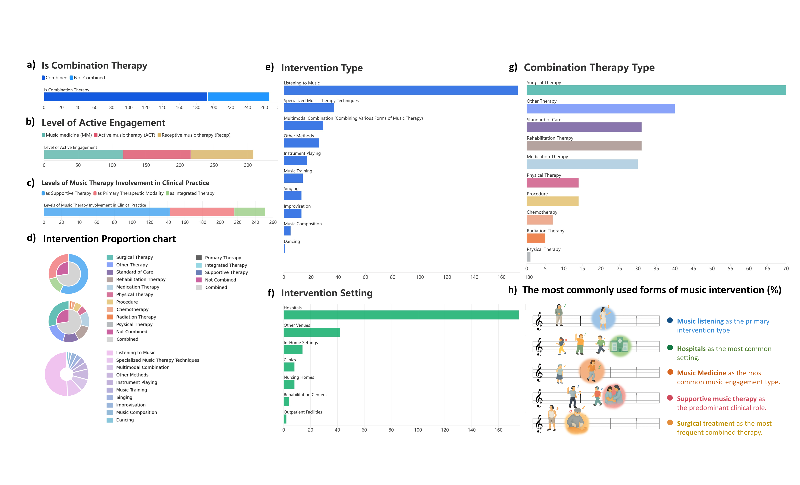
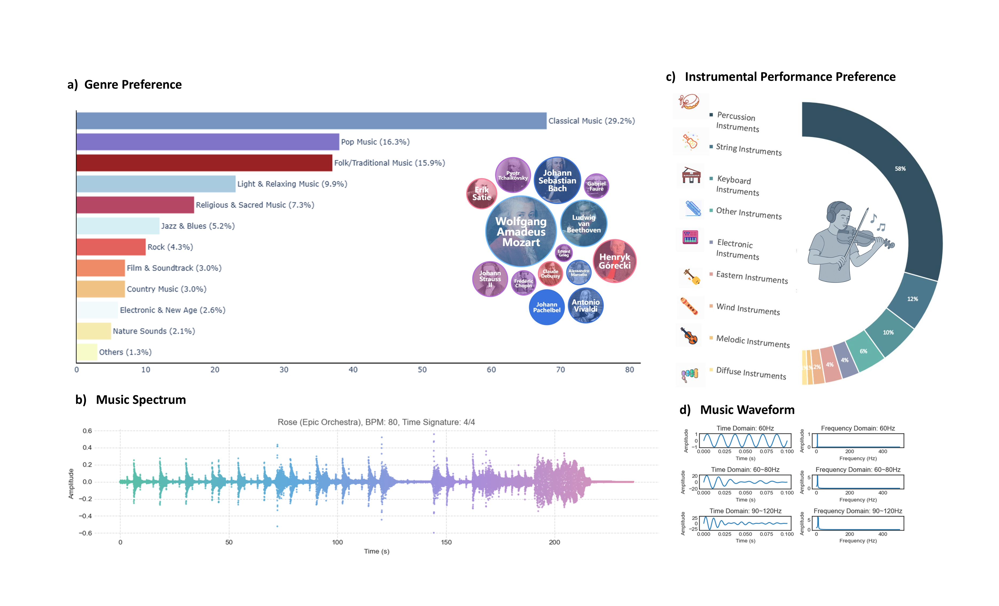
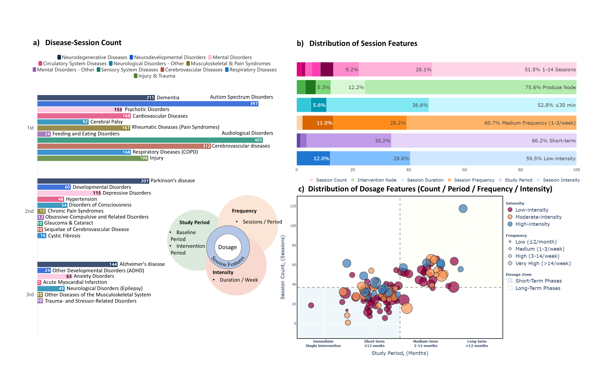
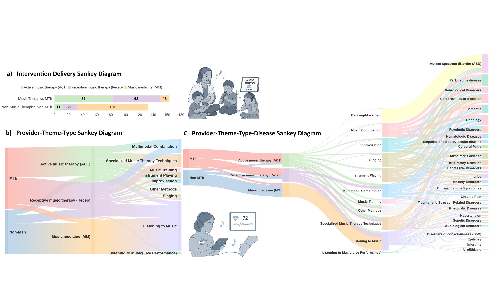

# Music Therapy Knowledge Database

We provide the public data tables, figure previews, and LLM-assisted extraction notebooks for a music therapy knowledge database project.
  
## Repository Contents

```text
.
├── code/
│   └── LLM_Extraction/        # Jupyter notebooks for LLM-assisted full-text extraction
├── data/                      # Public Excel tables derived from the knowledge database
├── figures/
│   ├── preview/               # PNG previews for GitHub display
│   └── high_resolution/       # High-resolution figure files that are small enough for normal GitHub upload
├── requirements.txt           # Python dependencies for the extraction notebooks
└── README.md
```


## Data Files

The `data/` folder contains the public structured tables:

- `1-Disease information.xlsx`
- `2-Study population characteristics.xlsx`
- `3-Reference information.xlsx`
- `4-Study design information.xlsx`
- `5-Music-baesd intervention design.xlsx`
- `6-Music therapy-based technologies.xlsx`
- `7-Session design.xlsx`
- `8-Intervention music design.xlsx`
- `SummaryofKnowledgeBaseData_standardized.xlsx`

## LLM-Assisted Extraction Code

The notebooks in `code/LLM_Extraction/` read a spreadsheet, locate PDFs by PMID, extract text from each PDF, send the text to an LLM with field-specific prompts, parse JSON output, and write extracted values back to Excel.

The notebooks are intended for first-pass assisted extraction only. Final database values should be checked manually against the original full texts.

Required user-filled settings inside each notebook:

- `OPENAI_BASE_URL`
- `OPENAI_API_KEY`
- `MODEL_NAME`
- `EXCEL_PATH`
- `OUTPUT_EXCEL_PATH`
- `PDF_DIR`
- `SHEET_NAME`

Install dependencies:

```bash
pip install -r requirements.txt
```

## Figure Preview


| Figure | Preview |
| --- | --- |
| Figure 1 |  |
| Figure 2 |  |
| Figure 3 |  |
| Figure 4 |  |


## Recommended Citation

Please cite the related manuscript when using this dataset or code. Update this section with the final paper citation after publication.

## License

This repository is licensed under the Creative Commons Attribution 4.0 International License (CC BY 4.0), unless otherwise stated.

The data tables, figures, and accompanying extraction notebooks may be reused with appropriate attribution. See `LICENSE` for details.

## Contact
For technical questions please open issue, or contact:
- Zhichuan Xu <zhichuanxu2001@163.com>
